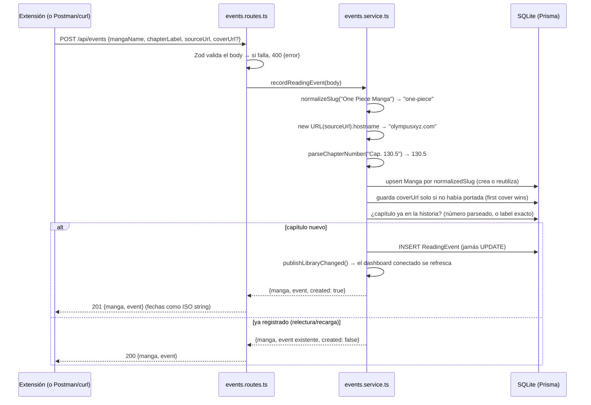

# Cómo funciona manga-tracker-api

Explicación detallada de todo el backend: qué hace cada archivo, qué funciones expone,
quién las usa y cómo funcionan por dentro; y al final, la parte operativa (Swagger, Postman,
el arranque automático y dónde viven tus datos).

> **Nota previa sobre "clases":** este código no tiene clases propias. Es el estilo
> idiomático de Bun + Hono: módulos que exportan **funciones puras** y **constantes**. Las
> únicas clases que se instancian vienen de las librerías (`OpenAPIHono`, `PrismaClient`,
> `PrismaLibSql`). Así que el recorrido va **archivo por archivo, función por función**, que
> es el equivalente exacto de "clase por clase, método por método" en este diseño.

---

## 1. Visión general

El sistema completo son tres piezas (tres repos separados); este repo es la primera:

1. **`manga-tracker-api`** (este repo) — guarda todo y expone la API REST en
   `http://127.0.0.1:5150`. Corre siempre, sola, gracias a un LaunchAgent de macOS.
2. **`manga-tracker-extension`** — extensión de navegador (MV3) que detecta qué manga y
   capítulo estás leyendo y se lo manda a la API, junto con la portada (`og:image`) si la
   página la declara. Su id es fijo (el manifest lleva `key`), por eso puede estar clavado
   en la lista CORS.
3. **`manga-tracker-dashboard`** — la web de tu biblioteca. Su build estático se copia a
   `public/` (con `bun run deploy` en ese repo) y esta misma API lo sirve en `/`,
   `/manga/:id` y `/duplicates`; se refresca solo escuchando el stream SSE
   (`GET /api/events/stream`).

**La regla de oro que atraviesa todo el diseño:** tu progreso nunca se borra solo ni
retrocede. Cada lectura se guarda como un **evento nuevo** (nunca se modifica ni borra uno
anterior — "append-only"), y el "capítulo al que llegaste" no es un campo guardado: se
**calcula** como el máximo de toda tu historia. Por eso, cuando un sitio cambia de servidor
y te muestra el capítulo 1 de nuevo, ese evento se guarda igual (es historia real) pero tu
progreso sigue siendo el máximo que alcanzaste.

La regla tiene exactamente dos matices, ambos deliberados:

- **Dedup estricto**: reportar un capítulo que **ya está** en la historia del manga (una
  relectura, o la página que recarga y re-reporta) no inserta nada — devuelve el evento
  guardado (`200` en vez de `201`). Un mismo capítulo es una fila, no veinte.
- **Borrado explícito**: `DELETE /api/mangas/{id}` existe para cuando VOS decidís sacar un
  manga entero (con toda su historia, vía `onDelete: Cascade`). Es la única puerta de
  salida de datos, siempre iniciada por el usuario — la aplicación jamás borra sola.

El viaje de una lectura:



La deduplicación vive en el slug: "One Piece", "One Piece Manga" y "one piece cómic" caen
todos en `one-piece`, así que aunque leas el mismo manga en tres sitios distintos, es **un
solo** registro con toda la historia unificada.

---

## 2. Arranque y base

### `src/index.ts` — el punto de entrada

Es el único archivo con `export default` (lo exige Bun para levantar el servidor). Hace
seis cosas, en orden:

1. **Crea la app**: `const app = new OpenAPIHono()` — un router de Hono que además sabe
   generar documentación OpenAPI a partir de las rutas.
2. **CORS**: `app.use("*", cors({ origin: allowedOrigins(...) }))` — la lista la arma
   `src/lib/cors.ts` a partir de la configuración, y por eso ya no hay ningún literal:
   `http://127.0.0.1:<PORT>` / `http://localhost:<PORT>` (el dashboard, que es same-origin)
   y un `chrome-extension://<id>` por cada id de `EXTENSION_IDS`. Son varios ids a propósito:
   cargada a mano, Chrome le da a la extensión el id que sale de la `key` de su manifest;
   publicada, la tienda le asigna otro, y los dos tienen que funcionar a la vez mientras las
   máquinas se actualizan. Un id mal escrito **corta el arranque** en vez de ignorarse en
   silencio — si no, la extensión queda muda meses después sin nada en los logs que lo explique.
   (Postman y curl no son navegadores: a ellos CORS no les aplica.)
3. **Red de seguridad de errores**: `app.onError(...)` — si algo revienta sin ser manejado,
   loguea el stack y responde `500 {"error": "Internal Server Error"}`. Toda la API usa ese
   mismo shape `{ error: string }` para cualquier error (400, 404, 500), así el cliente
   maneja una sola forma.
4. **Monta los módulos**: `health` en la raíz (`/health`) y los cuatro módulos de negocio
   bajo el prefijo `/api` (`app.route("/api", eventsRoutes)`, etc.). Al montar, Hono también
   fusiona la documentación de cada módulo en el spec global.
5. **Sirve el dashboard**: los estáticos de `public/` — `/assets/*` y `/favicon.svg` con
   `serveStatic` de `hono/bun`, y el `index.html` de la SPA **solo** en las tres rutas
   conocidas (`/`, `/manga/:id`, `/duplicates`). Ese fallback selectivo mantiene 404s
   reales en `/api/*`, `/docs` y `/openapi.json`; y mientras no hayas copiado ningún build
   (`bun run deploy` en `manga-tracker-dashboard`), esas rutas simplemente dan 404.
6. **Documentación**: `app.doc("/openapi.json", ...)` publica el spec OpenAPI 3.1 y
   `app.get("/docs", swaggerUI(...))` sirve la interfaz Swagger.

Al final exporta `{ port, hostname: "127.0.0.1", idleTimeout: 120, fetch: app.fetch }`:
Bun lee ese objeto y levanta el servidor HTTP. `hostname: "127.0.0.1"` es una decisión de
seguridad: el backend **solo** escucha en tu propia Mac, nadie de tu red puede tocarlo.
`idleTimeout: 120` existe por el stream SSE: Bun corta por defecto toda conexión que pase
10 segundos en silencio — incluso a mitad de un stream — y eso mataba el feed en vivo entre
latidos; 120 s de margen contra un latido cada 25 s lo mantienen siempre vivo (ver el
módulo `events`).

### `src/config.ts` — el único lector de variables de entorno

| Función/constante | Qué hace | Quién la usa |
|---|---|---|
| `required(name)` | Lee `Bun.env[name]` y **lanza un error si falta** — el server no arranca a medias | interna del archivo |
| `config` | `{ databaseUrl, port, extensionIds, mongo, migrationsDir }` — `DATABASE_URL` obligatoria; el resto opcional | `src/db/client.ts` (la URL), `src/index.ts` (puerto, orígenes y migraciones), `src/modules/sync/*` (Mongo) |
| `parsePort(raw)` | Valida `PORT`: vacío → 5150, entero 1–65535 → ese, cualquier otra cosa → error que **nombra el valor**. Antes era `Number(...)`, que convierte un typo en `NaN` y falla más tarde sin decir por qué | `src/config.ts` y `deploy/deploy.ts` (misma validación en los dos lados) |
| `parseExtensionIds(raw)` | Parte `EXTENSION_IDS` por comas y valida cada id (32 letras a–p). Vacío → el id de la extensión cargada a mano | `src/config.ts` |

Regla del repo: **ningún otro archivo lee variables de entorno**. Todo recibe valores desde
aquí. Eso hace trivial saber qué configuración existe y de dónde sale. Se evalúa al importar
el módulo: si `DATABASE_URL` no está, el proceso muere inmediatamente con un mensaje claro
en vez de fallar más tarde de forma confusa.

### `src/db/client.ts` — la conexión a la base

Tres líneas importantes:

```ts
const adapter = new PrismaLibSql({ url: config.databaseUrl });
export const prisma = new PrismaClient({ adapter });
```

`PrismaLibSql` es el adapter oficial de Prisma para SQLite vía libSQL — el único certificado
para Bun (`better-sqlite3` no funciona en Bun). `prisma` es un **singleton**: una sola
conexión para todo el proceso, que importan los cuatro services y los tests. Prisma genera
su cliente tipado en `src/generated/prisma/` (con `bun run db:generate`); esa carpeta está
gitignoreada y jamás se edita a mano.

### `prisma/schema.prisma` — el modelo de datos

Tres tablas:

- **`Manga`** — la identidad de cada obra: `canonicalName` (el nombre que ves, corregible),
  `normalizedSlug` (**único**, la clave de deduplicación — jamás se corrige a mano), y tres
  campos que curás desde el dashboard: `coverUrl` (nullable — la portada que capturó la
  extensión o que fijaste a mano), `status` (`"reading"` por defecto; también
  `"completed"` / `"dropped"`) y `tags` (un **string JSON** tipo `'["shonen","favs"]'` —
  SQLite no tiene columnas array ni enums, así que el array vive serializado y se valida en
  los bordes, ver `src/lib/schemas.ts`). Además, el almacenamiento local de la portada:
  `coverImage` + `coverImageType` (**Bytes** nullables — la imagen en sí, guardada en la
  base para que el archivo `.db` siga siendo el backup completo) y `coverVersion` (entero
  que se incrementa en **cada** mutación de portada; los clientes lo usan como
  cache-buster de `/cover` y para reintentar una carga que antes falló).
- **`ReadingEvent`** — el log append-only: `chapterLabel` (texto original, "Cap. 130.5"),
  `chapterNumber` (el número parseado, **nullable** si no se pudo parsear), `sourceUrl`,
  `sourceDomain` y `readAt`. Tiene dos detalles finos:
  - `@@index([mangaId, readAt(sort: Desc)])` — el índice que acelera la consulta típica de
    la biblioteca ("los eventos de este manga, del más nuevo al más viejo").
  - `onDelete: Cascade` — al borrar un Manga sus eventos caen con él (no quedan
    huérfanos). Es lo que hace limpio el `DELETE /api/mangas/{id}` del módulo `library`:
    una sola operación borra la obra y toda su historia.
- **`SiteAdapter`** — la "memoria" de cómo leer cada sitio: `domain` (único),
  `titleSelector` (obligatorio), `chapterSelector` y `chapterUrlRegex` (opcionales).

El `generator` es `prisma-client` (el nuevo de Prisma 7: ESM puro, sin binario engine), con
salida en `src/generated/prisma/`. La URL de conexión no vive en el schema sino en
`prisma.config.ts` (convención de Prisma 7), que también la toma de `DATABASE_URL`.

---

## 3. Utilidades compartidas (`src/lib/`)

Regla del repo: `lib/` contiene **solo funciones puras** (sin base de datos, sin red, sin
estado). Los módulos las usan; `lib` no importa nada de los módulos.

### `src/lib/normalize.ts` — la limpieza de nombres (el corazón de la deduplicación)

| Función | Firma | Quién la usa |
|---|---|---|
| `normalizeSlug` | `(name: string) => string` | `events.service.ts` |
| `parseChapterNumber` | `(text: string) => number \| null` | `events.service.ts` |

**`normalizeSlug`** convierte el nombre tal como aparece en la web en una clave estándar
comparable. Pasos, en orden: minúsculas → quitar acentos (descompone con `normalize("NFD")`
y borra los diacríticos combinantes) → reemplazar todo lo que no sea `a-z`, dígito, espacio
o guion por espacio → colapsar espacios/guiones en un solo `-` → quitar en bucle los sufijos
`-manga`, `-manhwa`, `-manhua`, `-comic`, `-novel` del final. Si el resultado queda vacío
(un nombre que era puro símbolo), devuelve `"unknown-title"`. Ejemplo:
`"Shingeki nó Kyojín Manga"` → `"shingeki-no-kyojin"`.

**`parseChapterNumber`** extrae el primer número (con decimal opcional, regex
`/\d+(\.\d+)?/`) del texto del capítulo: `"Cap. 130.5"` → `130.5`, `"Capítulo Especial"` →
`null`. **Lo calcula el servidor, nunca el cliente** — no se confía en lo que mande la
extensión.

### `src/lib/similarity.ts` — distancia entre nombres

| Función | Firma | Quién la usa |
|---|---|---|
| `levenshteinDistance` | `(a: string, b: string) => number` | `levenshteinSimilarity` (y tests) |
| `levenshteinSimilarity` | `(a: string, b: string) => number` (0 a 1) | `duplicates.service.ts` |

La distancia Levenshtein es "cuántas ediciones de un carácter (insertar/borrar/sustituir)
separan dos strings": `kitten → sitting` = 3. La implementación usa la programación dinámica
clásica de **dos filas**: en vez de la matriz completa de (n+1)×(m+1), guarda solo la fila
anterior y la actual, porque cada celda depende únicamente de esas dos — mismo resultado con
memoria O(n). Está escrita a mano (~25 líneas) en vez de traer una dependencia: para decenas
de slugs es sub-milisegundo y una librería solo agregaría superficie de ataque y updates.

`levenshteinSimilarity` la normaliza a 0–1: `1 - distancia / longitudMayor`. Idénticos
(incluidos ambos vacíos) → 1; vacío contra no-vacío → 0. Ejemplo real del sistema:
`solo-leveling` vs `solo-levelling` → distancia 1, similitud `1 - 1/14 ≈ 0.93`.

### `src/lib/http.ts` — el contrato de errores

| Export | Qué es | Quién lo usa |
|---|---|---|
| `errorSchema` | schema Zod `{ error: string }`, registrado como `"Error"` en OpenAPI | los cuatro módulos (respuestas 400/404) y los tests |
| `defaultHook` | interceptor de validaciones fallidas | los cuatro `new OpenAPIHono({ defaultHook })` |

Cuando un request no pasa la validación Zod de una ruta, `@hono/zod-openapi` invoca este
hook en lugar del handler. El hook concatena los problemas
(`"sourceUrl: Invalid URL; mangaName: ..."`) y responde `400 { error }`. Gracias a esto,
**ningún handler valida a mano**: declaran su schema y los errores salen solos, siempre con
el mismo shape que el `onError` global. Un cliente de esta API solo necesita entender
`{ error: string }` para cualquier fallo.

### `src/lib/schemas.ts` — los DTOs compartidos

| Export | Qué es | Quién lo usa |
|---|---|---|
| `mangaStatusSchema` / `MangaStatus` | enum Zod `"reading" \| "completed" \| "dropped"` | `mangaSchema` y el PUT de `library` |
| `mangaSchema` / `MangaDto` | schema Zod del Manga como lo devuelve la API (fechas ISO, `tags` ya como array, `status` como enum) | `events`, `library`, `duplicates` |
| `readingEventSchema` / `ReadingEventDto` | ídem para ReadingEvent | `events`, `library` |
| `toMangaDto(manga)` | entidad de Prisma (`Date`, `tags` como string JSON) → DTO (ISO, array real) | handlers de esos módulos |
| `toEventDto(event)` | ídem para eventos | ídem |
| `tagsFromJson(raw)` | parsea el string JSON de `tags`; corrupto o no-array degrada a `[]` en vez de romper el listado | `toMangaDto` y el handler de `/api/library` |
| `statusFromDb(raw)` | valida el `status` guardado; un valor inesperado lee como `"reading"` | ídem |

¿Por qué existe este archivo? Dos módulos distintos devuelven Mangas y eventos. Si cada uno
declarara su propio schema, o se registraría dos veces el componente `"Manga"` en OpenAPI, o
se bifurcaría el contrato. Y como los módulos **no pueden importarse entre sí** (regla de
dependencias), el lugar compartido es `lib`. Los mappers reciben parámetros tipados
estructuralmente (la forma, no el tipo de Prisma) para que `lib` no dependa de
`src/generated`. Y los dos helpers `tagsFromJson`/`statusFromDb` son la frontera
defensiva: la base guarda strings planos (límite de SQLite), pero la API jamás devuelve un
status inválido ni unos tags rotos — degradan, no explotan.

Los tipos de request/response de toda la API se derivan de estos schemas con `z.infer` —
nunca se escriben a mano, así el tipo y la validación no pueden divergir.

---

## 4. Los módulos (`src/modules/`)

Cada módulo es un "vertical slice": una carpeta con **tres archivos** — `*.routes.ts`
(las URLs: qué entra, qué sale, códigos de estado; solo valida y mapea), `*.service.ts`
(la lógica de verdad, es quien toca la base) y `*.test.ts` (sus pruebas). El patrón lo marca
`src/modules/health/`, el ejemplo mínimo. `events` suma una pieza extra colocada en su
carpeta: `events.bus.ts`, el bus de notificaciones (abajo).

Regla de aislamiento: los módulos **no se importan entre sí** — con una única excepción
sancionada: importar `events/events.bus.ts` para publicar "la biblioteca cambió" (lo hace
`library` tras un PUT o DELETE). Todo lo demás compartido vive en `lib`.

### `health` — el ping

- **`GET /health`** → `200 {"status": "ok"}`. Sin service (no hay lógica). Lo usan: vos
  (curl), el popup de la extensión para mostrar "Conectado", y launchd indirectamente
  (es cómo verificás que el agente está vivo).

### `events` — recibir cada lectura y avisar en vivo (el corazón)

**Rutas:**

| Ruta | Qué hace |
|---|---|
| `POST /api/events` | registra una lectura → `201` (evento nuevo) · `200` (capítulo ya registrado: devuelve el existente) · `400` |
| `GET /api/events/stream` | stream **SSE** permanente: emite `library-changed` cada vez que la proyección cambia |

Body del POST, validado:

| Campo | Regla |
|---|---|
| `mangaName` | string, sin espacios alrededor, no vacío |
| `chapterLabel` | ídem |
| `sourceUrl` | URL válida (garantiza que `new URL()` en el service nunca explote) |
| `coverUrl` | URL válida, **opcional** — el `og:image` que la extensión encontró en la página |

**Service** — `recordReadingEvent(input)` devuelve `{ manga, event, created }`:

1. `normalizeSlug(mangaName)` → la clave de deduplicación.
2. `new URL(sourceUrl).hostname` → el dominio (la API de URL ya lo devuelve en minúsculas).
3. `parseChapterNumber(chapterLabel)` → número o `null`.
4. `prisma.manga.upsert({ where: { normalizedSlug }, create: {...}, update: {} })` — si el
   manga ya existe lo reutiliza (el `update: {}` vacío significa "no le cambies nada"), si
   no lo crea con el nombre visible original.
5. **First cover wins**: si vino `coverUrl` y el manga aún no tiene portada, la guarda. Una
   portada ya guardada (automática o puesta a mano) **jamás** se pisa con lecturas
   posteriores; para cambiarla se limpia primero desde el dashboard (`coverUrl: null` en el
   PUT) y la próxima lectura la rellena. Este paso corre incluso cuando el reporte termina
   deduplicado.
6. **Dedup estricto por identidad de capítulo**: busca si ese capítulo ya está en la
   historia del manga — por `chapterNumber` parseado cuando existe ("Cap. 49" y
   "Chapter 49" son el mismo capítulo aunque el texto difiera), o por `chapterLabel`
   exacto cuando no se pudo parsear. Si ya estaba, devuelve ese evento con
   `created: false` (la ruta lo traduce a `200`): releer o recargar la página no infla la
   historia, sin importar cuán viejo sea el evento original.
7. Si es capítulo nuevo: `prisma.readingEvent.create(...)` — inserta, jamás UPDATE. No
   compara contra el máximo anterior: la regla anti-retroceso no vive acá, vive en la
   proyección de la biblioteca. Registrar el capítulo 1 después del 12 es correcto: es
   historia.
8. `publishLibraryChanged()` — avisa por el bus (también cuando lo único que cambió fue la
   portada de un reporte deduplicado), y el dashboard abierto se refresca al instante.

**`events.bus.ts`** — el bus de notificaciones en memoria. Un `Set` de listeners y dos
funciones: `subscribeLibraryChanges(listener)` (devuelve la función para desuscribirse) y
`publishLibraryChanged()` (invoca a todos). Sin colas, sin persistencia, sin payload: el
aviso significa "algo cambió, volvé a pedir la biblioteca". Es la única dependencia
permitida entre módulos — `library` lo importa para avisar tras sus escrituras.

**El stream SSE** (`GET /api/events/stream`) — Server-Sent Events: una respuesta HTTP que
nunca termina, por la que el servidor empuja eventos de texto que `EventSource` recibe en
el navegador sin hacer polling. El handler (con `streamSSE` de Hono) se suscribe al bus y
reenvía cada aviso como evento `library-changed`; registra la limpieza en `stream.onAbort`
(el navegador cerró → desuscribir, cero listeners zombis); y late un `ping` cada **25
segundos**. El latido no es decorativo: Bun corta conexiones tras 10 s de silencio por
defecto, así que `src/index.ts` sube `idleTimeout` a 120 s y el ping de 25 s mantiene el
stream siempre lejos de ese límite (esta pareja de números arregló el bug real de que el
feed moría entre latidos y el dashboard se perdía los updates).

### `library` — mirar y curar la biblioteca (jamás escribe eventos)

**Rutas:**

| Ruta | Qué hace |
|---|---|
| `GET /api/library` | un array de entradas proyectadas (ver abajo); filtros opcionales `?domain=` y `?since=<fecha ISO>` |
| `GET /api/mangas/{id}/history` | `{ manga, events }` con todos los eventos del más nuevo al más viejo · `404` si no existe |
| `PUT /api/mangas/{id}` | correcciones manuales; body `{ canonicalName?, status?, tags?, coverUrl? }`, al menos un campo — cambiar `coverUrl` (o limpiarlo con `null`) además descarta los bytes guardados de la portada vieja · `400`/`404` |
| `PUT /api/mangas/{id}/cover-image` | sube los **bytes** de la portada (body binario `image/*`, tope de 5 MB vía middleware `bodyLimit`) — los captura la extensión dentro del navegador real, el único cliente que los CDNs con muro de Cloudflare aceptan · `400`/`404`/`413` |
| `GET /api/mangas/{id}/cover` | la imagen de portada: los bytes guardados primero; si no hay, la **proxea** el servidor saltando el anti-hotlink (ver abajo) · `404` |
| `DELETE /api/mangas/{id}` | borra el manga y TODA su historia (cascade) · `204`/`404` |

**Service:**

- `getLibrary(filters)` — trae los mangas con sus eventos (ordenados desc por fecha), llama
  a `project` por cada uno y ordena las entradas por última actividad (lo más recién leído
  primero). Los filtros se traducen a condiciones Prisma: `domain` = "tiene
  al menos un evento en ese dominio", `since` = "tiene al menos un evento desde esa fecha".
- `project(manga)` (privada del archivo) — la función más importante de la lectura de datos.
  Por cada manga calcula:
  - **`reachedChapter`** = de todos los eventos con número parseado, el de número **máximo**
    (guarda `{ number, label }`). Como recorre los eventos del más nuevo al más viejo y usa
    `>` estricto, en caso de empate gana el más reciente. Si ningún evento tiene número →
    `null`. **Este es tu progreso real, y por construcción nunca puede retroceder.**
  - **`lastActivity`** = el evento más reciente a secas (`{ readAt, chapterLabel }`), aunque
    sea una relectura del capítulo 2. Te dice "cuándo fue la última vez que tocaste esto".
  - `lastSourceUrl` (la URL del evento más reciente — el "seguir leyendo" del dashboard),
    `readCount` (total de eventos) y `sourceDomains` (los sitios, sin duplicar), más los
    campos propios del manga: `coverUrl`, `coverVersion`, `hasStoredCover` (true cuando los
    bytes ya viven en la base — la extensión lo usa para saber qué portadas todavía
    necesita "sanar" subiendo sus bytes), `status` y `tags`.

  Separar `reachedChapter` de `lastActivity` es lo que hace inmune al sistema frente a
  cambios de servidor: el evento "capítulo 1 de nuevo" mueve `lastActivity` pero jamás
  `reachedChapter`.
- `getMangaHistory(id)` — manga + eventos desc, o `null` (la ruta lo traduce a 404).
- `updateManga(id, input)` — aplica **solo** los campos presentes: `canonicalName`,
  `status`, `tags` (se serializa a JSON al guardar) y `coverUrl` (string = portada manual;
  `null` = limpiarla). Cualquier cambio de `coverUrl` además **anula los bytes guardados**
  (pertenecían a la portada anterior) e incrementa `coverVersion`, avisándole a los
  clientes que la identidad de la portada cambió. El `normalizedSlug` queda intacto a
  propósito: es la clave de deduplicación; cambiarlo rompería el matching futuro o
  chocaría con otro manga. Al terminar publica en el bus para que el dashboard se
  refresque.
- `storeMangaCoverImage(id, bytes, contentType)` — guarda los bytes que subió la extensión
  (el `PUT /cover-image`) e incrementa `coverVersion`. Existe porque hay CDNs detrás del
  muro de Cloudflare que rechazan a **cualquier** cliente que no sea un navegador de
  verdad — a esos ni el proxy del servidor puede entrar, así que la extensión captura la
  imagen desde dentro del navegador y la manda como bytes.
- `fetchMangaCover(id)` — sirve la portada, en dos niveles. **Primero los bytes
  guardados**: si `coverImage` existe se devuelve directo — inmune a bloqueos de CDN y a
  que el sitio muera (se copia a un `ArrayBuffer` propio porque Prisma devuelve las
  columnas Bytes como vistas sobre un buffer compartido con otros datos). Si no hay bytes
  pero sí `coverUrl`, entra el **truco anti-hotlink**: algunos CDNs de portadas (caso
  real: `img2mw.xyz`, el CDN de manhwaweb) solo sirven la imagen si el request trae el
  `Referer` de su propio sitio — y un navegador **jamás** puede mandar el referer de otro
  sitio, así que el dashboard vería 403 eternos. El servidor local sí puede: intenta la
  descarga con el `Referer` de **cada sitio donde se leyó el manga** (del más reciente al
  más viejo, hasta 4 — tras una migración de sitio la portada suele pertenecer al CDN del
  sitio *anterior*, que solo acepta su propio referer) y un User-Agent de navegador; si
  todos fallan, **reintenta sin referer** (hay CDNs que bloquean referers ajenos pero
  aceptan ninguno). Valida que la respuesta sea `image/*` (nunca reenvía una página de
  error como si fuera imagen), con timeout de 10 s por intento. **El primer fetch que
  funciona persiste los bytes** en la base (e incrementa `coverVersion`): cada portada se
  descarga de su CDN a lo sumo UNA vez en la vida. La ruta la sirve con `Cache-Control` de
  un día — seguro porque el dashboard agrega `?v=<hash de coverUrl + coverVersion>` como
  cache-buster, así cambiar la portada (URL o bytes) invalida el caché solo. El `fetch` es
  inyectable para que los tests simulen CDNs sin tocar la red.
- `deleteManga(id)` — borra el manga; sus eventos caen con él por `onDelete: Cascade`. Es
  la única puerta sancionada de salida de datos del log, siempre una decisión explícita
  tuya desde el dashboard. También publica en el bus.

### `adapters` — la memoria de cómo leer cada sitio

Cuando la detección automática falle en un sitio, la extensión te hará calibrar con dos
clics y guardará aquí los selectores CSS. La próxima visita a ese sitio ya no pregunta.

**Rutas:** `GET /api/adapters/{domain}` (→ config guardada o `404` si es un sitio nuevo — el
404 aquí es información útil, no un error: significa "calibrá") y `POST /api/adapters`
(guarda o reemplaza; `titleSelector` obligatorio, `chapterSelector`/`chapterUrlRegex`
opcionales).

**Service:** `getAdapterByDomain(domain)` y `upsertAdapter(input)`. Dos decisiones:

- **Dominios siempre en minúsculas** (los hostnames son case-insensitive; así
  `OlympusXYZ.com` y `olympusxyz.com` son la misma fila).
- **Semántica de reemplazo total**: recalibrar reemplaza TODA la config — si el nuevo POST
  no trae `chapterSelector`, el guardado se borra (`?? null`). Es lo que espera el flujo de
  calibración: "así se lee este sitio ahora", no un merge parcial con datos viejos.

### `duplicates` — detectar repetidos (solo sugiere, no fusiona)

**Ruta:** `GET /api/duplicates` → array de `{ a, b, similarity }` ordenado de más a menos
parecido.

**Service:** `findDuplicatePairs()` — trae todos los mangas y compara **cada par** de slugs
(doble loop `i < j`, O(n²) — con decenas de mangas es sub-milisegundo) con
`levenshteinSimilarity`. Los pares con similitud ≥ `SIMILARITY_THRESHOLD` (0.85, constante
del service porque es política de dominio, no matemática) se devuelven como sugerencia.

¿Por qué no hay fusión automática? Fusionar implicaría mover eventos de un manga a otro — un
UPDATE — y eso contradice la regla append-only. Por ahora: se detecta, y se corrige a mano
el nombre con `PUT /api/mangas/{id}`. Si algún día hace falta fusionar de verdad, se hará
con una tabla de alias resuelta en la proyección, sin tocar eventos.

---

## 5. Los tests (74, todos contra una base real)

### La infraestructura: `bunfig.toml` + `test-setup.ts`

Problema: `config.ts` exige `DATABASE_URL` al importarse, y los tests no deben tocar tu
`dev.db`. Solución:

- `bunfig.toml` le dice a Bun que **antes** de cargar cualquier test ejecute
  `test-setup.ts` (un "preload").
- `test-setup.ts` hace tres cosas: (1) apunta `DATABASE_URL` a un archivo SQLite **temporal
  y único por corrida** (en el tmp del sistema, con pid+timestamp en el nombre); (2) le
  aplica las migraciones reales del repo ejecutando el SQL de `prisma/migrations/` con
  `bun:sqlite` (síncrono, integrado en Bun, ~1 ms — sin arrancar el CLI de Prisma); (3)
  registra un `afterAll` que borra el archivo al terminar.

Resultado: cada `bun test` corre contra una base descartable con el **mismo schema exacto**
que producción, y cada archivo de test empieza limpiando las tablas (`beforeEach` con
`deleteMany`) para aislarse de los demás. Borrar filas en una base desechable no viola la
regla append-only — esa regla gobierna el código de la aplicación, no la higiene del arnés
de pruebas.

Los tests de rutas no levantan un servidor: `eventsRoutes.request("/events", {...})` ejecuta
el router Hono en memoria, con validación Zod y base real incluidas — integración completa
sin puertos.

### Qué cubre cada archivo

| Archivo | Tests | Lo más importante que prueba |
|---|---|---|
| `health.test.ts` | 1 | el ping responde `{status:"ok"}` |
| `normalize.test.ts` | 6 | acentos, sufijos apilados ("One Piece Manga" = "One Piece"), entradas raras |
| `similarity.test.ts` | 8 | distancias conocidas (kitten→sitting=3), simetría, umbral 0.85 |
| `schemas.test.ts` | 8 | mappers Date→ISO, `chapterNumber` null intacto, tags corruptos → `[]`, status desconocido → `"reading"` |
| `events.test.ts` | 13 | dedup por slug, **anti-retroceso** (10,11,12 y luego 1 → 4 inserts), **dedup estricto** ("Cap. 49" = "Chapter 49" → 200; labels sin número, por texto exacto), first cover wins, 400s |
| `events.bus.test.ts` | 2 | publicar notifica a todos los suscriptos; desuscribirse deja de notificar |
| `library.test.ts` | 28 | **la regla de oro como test**: reached=12 con lastActivity=Cap. 1; orden por actividad; `lastSourceUrl`; filtros; PUT parcial (nombre/status/tags/portada) sin tocar el slug; portadas: upload de bytes (content-type, tope 5 MB, versión que sube), bytes guardados servidos sin tocar la red, el proxy recorre el referer de cada sitio leído y reintenta sin referer, persiste los bytes al primer éxito, cambiar `coverUrl` los descarta; DELETE arrastra toda la historia |
| `adapters.test.ts` | 5 | round-trip, replace total en recalibración, case-insensitive, 404/400 |
| `duplicates.test.ts` | 3 | exactamente el par esperado con sim ≈ 0.93, listas vacías |

---

## 6. Swagger: de dónde sale la documentación

No hay documentación escrita a mano. Cada ruta se define con `createRoute({...})`
declarando sus schemas Zod de entrada y salida. De esa única fuente salen **tres** cosas a
la vez: la validación en runtime, los tipos de TypeScript (`z.infer`) y el spec OpenAPI.

- `GET /openapi.json` — el spec OpenAPI 3.1 generado: cada `createRoute` aporta su path, y
  cada schema con `.openapi("Nombre")` se registra como componente reutilizable (`Manga`,
  `ReadingEvent`, `Error`, `LibraryEntry`...).
- `GET /docs` — la **Swagger UI**: una página que lee ese JSON y lo dibuja interactivo.
  Abrí `http://127.0.0.1:5150/docs`, expandí una ruta, botón **"Try it out"** → completás el
  body → **Execute** → ves el request y la respuesta reales. Es la forma más rápida de
  probar la API sin instalar nada.

La consecuencia práctica: la documentación **no puede mentir**. Si cambia un schema, cambia
la validación, el tipo y el doc en el mismo commit, porque son la misma cosa.

## 7. Postman: cómo se arma la colección

No existe un archivo de colección guardado en el repo — se genera desde el contrato:

1. Postman → **Import** → pestaña **URL** → pegar `http://127.0.0.1:5150/openapi.json` →
   **Import**.
2. Postman lee el spec y **genera la colección completa**: una carpeta por tag (`events`,
   `library`, `adapters`, `duplicates`, `health`), cada request con su método, URL,
   parámetros y un body de ejemplo derivado del schema.
3. Cuando el repo gane rutas nuevas, repetís el import (o usás re-sync si guardaste el link)
   y la colección se regenera. La fuente de verdad siempre es `/openapi.json`, nunca la
   colección.

Recordá: Postman corre en tu Mac, así que `127.0.0.1` le funciona; CORS no aplica (es solo
para navegadores). Y lo que escribas por Postman contra el puerto 5150 va a la **base de
producción** — para experimentar sin ensuciar, usá el flujo dev de la sección siguiente.

## 8. El arranque automático: launchd y el LaunchAgent

**launchd** es el sistema de macOS que arranca y supervisa procesos (el equivalente de
systemd en Linux). Un **LaunchAgent** es una receta en XML (un `.plist`) que le dice "mantené
este programa corriendo para este usuario". La nuestra vive en
`~/Library/LaunchAgents/com.mangatracker.plist` y dice:

| Clave | Valor | Qué significa |
|---|---|---|
| `Label` | `com.mangatracker` | el nombre del servicio para launchctl |
| `ProgramArguments` | `.../mise/installs/bun/latest/bin/bun run src/index.ts` | qué ejecutar (la ruta **absoluta** de bun — launchd no tiene tu PATH; en esta Mac bun lo administra mise, no Homebrew) |
| `WorkingDirectory` | este repo | desde dónde ejecutarlo (por eso `src/index.ts` resuelve) |
| `EnvironmentVariables` | `DATABASE_URL` (base de producción) y `PORT=5150` | producción usa SU base, sin tocar tu `.env` de desarrollo |
| `RunAtLoad` | true | arranca solo al iniciar sesión en la Mac |
| `KeepAlive` | true | si el proceso muere, launchd lo **resucita** en 1–2 segundos |
| `StandardOut/ErrorPath` | `~/Library/Logs/MangaTracker/{out,err}.log` | dónde caen los logs |

El ciclo de vida completo: encendés la Mac → iniciás sesión → launchd lee el plist y lanza
bun → la API queda escuchando en 5150. Si crashea, vuelve sola (está validado: matamos el
proceso y launchd lo relanzó con otro pid). Si reiniciás la Mac, vuelve sola. No hay nada
que abrir, nunca.

**Comandos útiles** (los tenés también en `.claude/skills/deploy/`):

```bash
# ¿Está vivo?
curl http://127.0.0.1:5150/health
launchctl print gui/$(id -u)/com.mangatracker | grep state

# Ver logs
tail -f ~/Library/Logs/MangaTracker/err.log

# Desarrollo: liberar el puerto 5150, trabajar con dev.db, y volver
launchctl bootout gui/$(id -u)/com.mangatracker     # apaga producción
bun run dev                                          # dev con hot-reload (.env → dev.db)
launchctl bootstrap gui/$(id -u) ~/Library/LaunchAgents/com.mangatracker.plist  # vuelve producción

# Publicar un cambio: un solo comando (ver la sección 8.1)
bun run deploy
```

### 8.1. `bun run deploy` — publicar con un comando

Antes esto eran cuatro pasos a mano y era fácil saltarse uno. Ahora
`deploy/deploy.ts` los encadena y aborta apenas algo falla:

1. **Estado de git.** Avisa si estás fuera de `main` o si hay cambios sin commitear.
   No te frena: es información, porque a veces querés probar una rama en producción.
   Avisa porque producción **corre el checkout actual**, no `main` — launchd apunta al
   directorio del repo, así que lo que esté ahí es lo que sirve.
2. **Pre-vuelo:** `lint`, `typecheck` y los tests. Si alguno falla, corta acá y
   **producción ni se entera** — sigue corriendo la versión anterior.
3. **Migraciones** contra la base de producción. Si fallan, tampoco reinicia nada.
4. **Recarga del LaunchAgent**: `bootout` + `bootstrap` completo.
5. **Sonda de salud**: pide `/health` hasta 15 veces, una por segundo, porque launchd
   tarda un instante en levantar el proceso y una sola consulta inmediata daría un
   falso negativo.
6. **Estado del sync**, informativo: te dice si la réplica quedó habilitada.

| Flag | Para qué |
|---|---|
| `--dry-run` | Muestra cada paso sin tocar nada |
| `--with-env` | Antes de todo, refresca el plist desde Key Vault |
| `--skip-checks` | Saltea lint, typecheck y tests |

**Por qué la recarga es completa y no `kickstart -k`.** `kickstart` reinicia el proceso
contra la configuración que launchd ya tiene en memoria: si cambiaste una variable en
`EnvironmentVariables`, la **ignora en silencio**. Terminás depurando un deploy que
"funcionó" pero sigue usando la credencial vieja. `bootout` + `bootstrap` releen el
plist desde cero.

**Y por qué entre los dos hay una espera.** Esto costó una caída de producción, así que
vale la pena entenderlo. `launchctl bootout` **es asíncrono**: vuelve apenas launchd
acepta la orden, no cuando el job terminó de bajar. Si hacés `bootstrap` de inmediato,
entrás a un dominio que todavía sostiene el job agonizando y launchd responde:

```
Bootstrap failed: 5: Input/output error
```

…y te quedás sin servicio. Es una condición de carrera, y por eso es traicionera: solo
aparece cuando el servicio **estaba corriendo**, o sea en todo deploy real, mientras que
un `--dry-run` o un deploy sobre un servicio ya caído pasan sin problema.

La secuencia correcta, que es la que implementa `deploy/lib/macos.ts`:

1. `bootout`
2. **esperar** consultando `launchctl print` hasta que el servicio desaparezca del dominio
   (con techo de ~5 s, no un `sleep` fijo)
3. `bootstrap`, con hasta 3 intentos — el desmontaje puede seguir asentándose incluso
   después de que `print` deje de encontrarlo

A mano sería:

```bash
launchctl bootout gui/$(id -u)/com.mangatracker
while launchctl print gui/$(id -u)/com.mangatracker >/dev/null 2>&1; do sleep 0.25; done
launchctl bootstrap gui/$(id -u) ~/Library/LaunchAgents/com.mangatracker.plist
```

**Si el `bootstrap` falla**, el script no se calla: el servicio queda caído y te imprime
el comando exacto para levantarlo a mano. Un deploy roto que no avisa es peor que uno
que falla ruidosamente.

### 8.2. Las variables de entorno y Azure Key Vault

El problema concreto: la connection string de Azure DocumentDB lleva la contraseña del
cluster. No puede ir al repo. Pero si vivís solo en el plist de una Mac, formatear esa
Mac te deja sin nada.

La solución tiene tres niveles, y `bun run env:pull` los recorre **del más barato al más
caro**:

1. **El plist** (`~/Library/LaunchAgents/com.mangatracker.plist`) — ya configurado, gratis.
2. **El Keychain de macOS** (servicio `manga-tracker-mongodb`) — local, offline,
   sobrevive a reinstalar la app.
3. **Azure Key Vault** (`kv-mangatracker`, secreto `mangatracker-mongodb-url`) —
   sobrevive a formatear el disco.

Lo que encuentra en el nivel 3 lo cachea en el 2, así la próxima vez funciona sin red.

**Por qué Key Vault y no un archivo en Azure Storage.** Para leer un blob necesitás la
access key de la storage account: otro secreto que tenés que tener guardado *antes* de
poder leer tus secretos. El huevo y la gallina. Con Key Vault la raíz de confianza es tu
cuenta de Azure: `az login` y listo, no hay nada que guardar en disco.

**Qué sube y qué no.** `deploy/lib/env.ts` clasifica cada variable, y solo una viaja:

| Variable | Tipo | Por qué |
|---|---|---|
| `MONGODB_URL` | `secret` | Es el único secreto compartido → va al vault |
| `DATABASE_URL` | `machine` | Es una ruta absoluta: subirla sería subir basura, en otra Mac no aplica |
| `MONGODB_DB` | `profile` | Se deriva: `mangatracker` en prod, `mangatracker_dev` en dev |
| `PORT` | `profile` | Constante |

Agregar una variable mañana es **una entrada más en esa lista**, no editar cuatro scripts.

**Los comandos:**

```bash
bun run deploy:provision   # crea el Key Vault y te da permisos (idempotente)
bun run env:push           # sube MONGODB_URL al vault (lee .env)
bun run env:push --prod    # idem, pero leyendo el plist
bun run env:pull           # escribe .env para desarrollo
bun run env:pull --prod    # escribe el plist de producción
```

`bun run sync:bootstrap` sigue existiendo: ahora es un alias de `env:pull --prod`.

**Para ver todo junto: `bun run env:show`.** No escribe nada y no toca la red — resuelve
los secretos mirando solo el plist y el Llavero. Te muestra cada variable en los dos
perfiles y, abajo, si tus archivos están al día:

```
MONGODB_URL  [secret]
  vault     kv-mangatracker / mangatracker-mongodb-url
  plist     sha 42e6bb81
  keychain  sha 42e6bb81

MONGODB_DB  [profile]
  dev       mangatracker_dev
  prod      mangatracker

On disk
! .env   absent
• plist  4/4 match the prod profile
```

Los secretos salen como **hash corto**, nunca el valor: alcanza para comparar dos máquinas
o detectar que el plist y el Llavero se desincronizaron, y es seguro pegarlo en un chat.

### 8.3. Por qué NO hay un directorio `env/` con un archivo por entorno

Es lo primero que uno piensa (`env/env.local`, `env/env.prod`, `env/env.desa`), y hay dos
razones concretas por las que acá sería peor:

- **Bun no los cargaría.** Bun lee automáticamente `.env`, `.env.production` /
  `.env.development` / `.env.test` (según `NODE_ENV`) y `.env.local`, y **solo desde el
  directorio actual**. Un `env/env.local` exigiría pasar `--env-file` en `bun run dev`, en
  el plist y en los tests: tres lugares para desincronizarse.
- **El `.gitignore` no los cubre.** Hoy ignora `.env` y `.env.*`. Un `env/env.local` **no**
  matchea ninguno de los dos patrones: el primer `git add .` publicaría la contraseña del
  cluster en GitHub.

Y el argumento de fondo: acá hay **un solo secreto**. Tres archivos serían tres copias de
la misma contraseña en disco, que se desincronizan entre sí. El manifiesto ya es la lista
única de "todos los entornos y sus valores", y `env:show` la hace visible sin duplicar nada.

**Dos trampas de Azure que el provision resuelve solo**, y que si no las conocés te
cuestan una tarde:

- Una suscripción que **nunca** usó Key Vault tiene el proveedor `Microsoft.KeyVault`
  sin registrar, y toda creación falla con `MissingSubscriptionRegistration`. El script
  detecta el estado y registra (es una sola vez por suscripción).
- **Crear un vault no te da acceso a sus secretos.** Desde la versión de API `2026-02-01`
  el modelo por defecto es RBAC, y el plano de control (crear el vault) está separado del
  plano de datos (leer y escribir secretos). Sin asignarte el rol **Key Vault Secrets
  Officer**, el primer `secret set` responde 403. El script se lo asigna y después
  **espera** a que propague, porque una asignación de rol tarda minutos en hacerse
  efectiva.

**Una trampa de Bun con los `.env`**, verificada a mano contra el runtime: Bun **expande
`$`** en el valor, y lo hace con comillas dobles, con comillas simples y sin comillas.
Una contraseña con `$` se convertiría en otra cosa **sin ningún error**. Además un `#` sin
comillas corta el valor ahí mismo. Por eso `env:pull` escribe todo entre comillas dobles
con el `$` escapado como `\$`. Y como Bun *no* desescapa `\"` ni `\\` (los deja con la
barra pegada), un valor con comillas o barras **no es representable**: el script se niega
a escribirlo en vez de corromper la credencial en silencio.

El archivo se reescribe leyendo el anterior, no generándolo de cero: los comentarios, el
orden y **cualquier variable tuya que el manifiesto no conozca** sobreviven al pull.

## 9. Dónde viven tus datos (y qué pasa si borrás el repo)

| Qué | Dónde | ¿Sobrevive si borrás el repo? |
|---|---|---|
| **Tu biblioteca real** (producción) | `~/Library/Application Support/MangaTracker/mangatracker.db` | ✅ **Sí** — está fuera del repo a propósito |
| Logs del servicio | `~/Library/Logs/MangaTracker/` | ✅ Sí |
| La receta del LaunchAgent | `~/Library/LaunchAgents/com.mangatracker.plist` | ✅ Sí (pero ver abajo) |
| Base de desarrollo (`dev.db`) | raíz del repo (gitignoreada) | ❌ Se pierde — son datos de prueba, da igual |
| Build del dashboard (`public/`) | raíz del repo (gitignoreado) | ❌ Se regenera con `bun run deploy` en `manga-tracker-dashboard` |
| `.env` | raíz del repo (gitignoreado) | ❌ Se pierde — se recrea en 5 segundos |
| El código | el repo + GitHub | ✅ En GitHub |

O sea: **borrar el repo no borra tu biblioteca**. La base de producción es un archivo SQLite
normal fuera del repo. Lo que sí pasa es que el backend **deja de poder arrancar**: el plist
apunta al repo (`WorkingDirectory` + `bun run src/index.ts`), así que launchd intentará
lanzarlo, fallará y lo verás en `err.log`.

**Receta de recuperación** (repo borrado o Mac nueva):

```bash
cd ~/Documents/Git
git clone https://github.com/gastonlarap-a11y/manga-tracker-api.git
cd manga-tracker-api
bun install
bun run db:generate         # regenera el cliente de Prisma (gitignoreado)
az login                    # la raíz de confianza para recuperar la credencial
bun run env:pull            # escribe .env para desarrollo (baja el secreto del vault)
bun run deploy              # migraciones + LaunchAgent, con TU base intacta
# el dashboard (public/ también es gitignoreado):
cd ../manga-tracker-dashboard && bun run deploy
```

En una Mac **nueva** (donde el plist todavía no existe) el orden es el mismo, pero primero
hay que crear el LaunchAgent: el XML completo está en `PLAN.md` (Fase 3). Con el plist ya
puesto, `bun run env:pull --prod` le inyecta la credencial y `bun run deploy` levanta todo.

(En una Mac nueva además: instalar bun, ajustar su ruta en el plist si difiere, copiar el
plist, `launchctl bootstrap`, y llevarte el `.db` — ver la portabilidad abajo.)

**Backups y portabilidad:** hay dos capas, y conviene entender por qué son dos.

La primera es la de siempre: Time Machine ya cubre `~/Library/Application Support/`, así que
tu biblioteca se respalda sola, y migrar a otra Mac es literalmente copiar `mangatracker.db`
a la misma carpeta. La base es un único archivo — por eso las portadas se guardan como bytes
*dentro* de la base y no como archivos sueltos.

La segunda es la **sincronización con Azure DocumentDB**, que cubre dos cosas que Time Machine
no puede: perder la Mac entera entre snapshots, y usar dos computadores. Se activa poniendo
`MONGODB_URL`; sin esa variable el módulo queda completamente inerte y la app se comporta igual
que antes de que existiera.

Lo primero que hay que entender es qué **no** hace: la nube nunca se mete en el camino de un
request. SQLite sigue contestando todas las lecturas y escrituras. La alternativa tentadora —
"si hay internet leo de Azure, si no leo de SQLite" — suena mejor y es peor: no existe
transacción entre un archivo local y un cluster remoto, así que en cuanto una escritura remota
falla las dos copias divergen, y desde ahí tu biblioteca mostraría cosas distintas según si hay
wifi. Capítulos que desaparecen al conectarte. En un tracker cuya única razón de existir es no
perder el progreso, ese es el peor modo de falla posible.

Lo que sí hace es **converger**: cada sincronización primero trae lo que las otras máquinas
escribieron, lo mezcla, y recién después empuja lo suyo. Las reglas son tres, y cada una sale de
una propiedad del modelo de datos:

- **Los eventos de lectura** son append-only con UUID inmutables, así que mezclarlos es la unión
  de dos conjuntos. **Nada se borra jamás por estar ausente de un lado.** Esto no es un detalle:
  la primera versión sí borraba lo ausente, y eso significaba que volver a una PC desactualizada
  y leer un solo capítulo borraba de la nube todo lo leído en la otra. El código actual
  directamente no tiene un método para borrar eventos.
- **Mangas y adapters** son mutables, así que gana el `updatedAt` más nuevo. Esa columna la
  escribe a mano cada writer, nunca `@updatedAt` de Prisma: ese atributo pisa el valor en cada
  escritura, con lo cual aplicar el documento de la otra máquina lo dejaría como "recién
  modificado" y las dos se lo pasarían de ida y vuelta para siempre.
- **Borrar** un manga ya no borra la fila: le pone `deletedAt`. Así el borrado viaja como un
  hecho y se resuelve con la misma regla que cualquier otro campo. Sus eventos quedan guardados,
  y volver a leer la serie la resucita con todo su historial.

Un detalle que evita un choque real: los documentos se identifican por `normalizedSlug`, no por
el UUID local. Si descubrís el mismo manga en las dos PCs antes de sincronizar, se crean dos UUID
distintos con el mismo slug; identificando por slug las dos escriben el **mismo** documento y se
mezclan, en vez de chocar contra el índice único.

Los bytes de portada viajan en una pasada aparte cada 6 h, no en cada cambio: medidos contra el
cluster tardan ~790 ms por MB, y una portada puede pesar 5 MB. Ese tráfico periódico además
evita que el cluster gratuito se pause por inactividad.

**Cambiar de computador no requiere hacer nada.** Instalás, `az login`, `bun run env:pull --prod`
para recuperar la credencial (la busca en el plist, después en el Llavero de macOS y por último en
Azure Key Vault — ver la sección 8.2), `bun run deploy`, y la primera sincronización trae la
biblioteca entera. De ahí en adelante abrís la app en la máquina que estés usando y lo que leíste
en la otra ya está. El
endpoint `POST /api/sync/restore` sigue existiendo pero para otra cosa: tirar la base local a la
basura y reconstruirla, por ejemplo si se corrompió.

La única suposición del diseño es que el desempate por fecha usa el reloj de cada máquina. Con un
solo usuario y dos Macs con NTP, sin editar el mismo manga en dos lados a la vez, es seguro.
