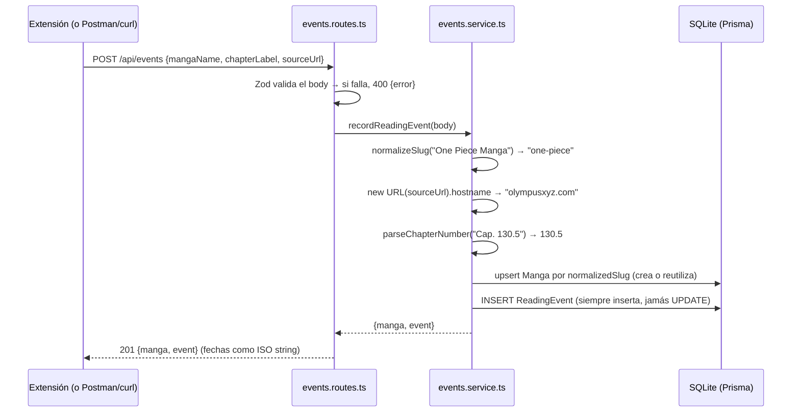

# Cómo funciona manga-tracker-api

Explicación detallada de todo el backend: qué hace cada archivo, qué funciones expone,
quién las usa y cómo funcionan por dentro; y al final, la parte operativa (Swagger, Postman,
el arranque automático y dónde viven tus datos).

> **Nota previa sobre "clases":** este código no tiene clases propias. Es el estilo
> idiomático de Bun + Hono: módulos que exportan **funciones puras** y **constantes**. Las
> únicas clases que se instancian vienen de las librerías (`OpenAPIHono`, `PrismaClient`,
> `PrismaLibSql`). Así que el recorrido va **archivo por archivo, función por función**, que
> es el equivalente exacto de "clase por clase, método por método" en este diseño.

---

## 1. Visión general

El sistema completo son tres piezas (tres repos separados); este repo es la primera:

1. **`manga-tracker-api`** (este repo) — guarda todo y expone la API REST en
   `http://127.0.0.1:5150`. Corre siempre, sola, gracias a un LaunchAgent de macOS.
2. **`manga-tracker-extension`** (futura) — extensión de navegador que detecta qué manga y
   capítulo estás leyendo y se lo manda a la API.
3. **`manga-tracker-dashboard`** (futura) — web para mirar tu biblioteca; la servirá esta
   misma API desde `/`.

**La regla de oro que atraviesa todo el diseño:** tu progreso nunca se borra ni retrocede.
Cada lectura se guarda como un **evento nuevo** (nunca se modifica ni borra uno anterior —
"append-only"), y el "capítulo al que llegaste" no es un campo guardado: se **calcula** como
el máximo de toda tu historia. Por eso, cuando un sitio cambia de servidor y te muestra el
capítulo 1 de nuevo, ese evento se guarda igual (es historia real) pero tu progreso sigue
siendo el máximo que alcanzaste.

El viaje de una lectura:



La deduplicación vive en el slug: "One Piece", "One Piece Manga" y "one piece cómic" caen
todos en `one-piece`, así que aunque leas el mismo manga en tres sitios distintos, es **un
solo** registro con toda la historia unificada.

---

## 2. Arranque y base

### `src/index.ts` — el punto de entrada

Es el único archivo con `export default` (lo exige Bun para levantar el servidor). Hace
cinco cosas, en orden:

1. **Crea la app**: `const app = new OpenAPIHono()` — un router de Hono que además sabe
   generar documentación OpenAPI a partir de las rutas.
2. **CORS**: `app.use("*", cors({ origin: [...] }))` — solo acepta peticiones de navegador
   originadas en `http://127.0.0.1:5150` y `http://localhost:5150` (el futuro dashboard).
   Cuando exista la extensión, se agregará su `chrome-extension://<id>` a esta lista.
   (Postman y curl no son navegadores: a ellos CORS no les aplica.)
3. **Red de seguridad de errores**: `app.onError(...)` — si algo revienta sin ser manejado,
   loguea el stack y responde `500 {"error": "Internal Server Error"}`. Toda la API usa ese
   mismo shape `{ error: string }` para cualquier error (400, 404, 500), así el cliente
   maneja una sola forma.
4. **Monta los módulos**: `health` en la raíz (`/health`) y los cuatro módulos de negocio
   bajo el prefijo `/api` (`app.route("/api", eventsRoutes)`, etc.). Al montar, Hono también
   fusiona la documentación de cada módulo en el spec global.
5. **Documentación**: `app.doc("/openapi.json", ...)` publica el spec OpenAPI 3.1 y
   `app.get("/docs", swaggerUI(...))` sirve la interfaz Swagger.

Al final exporta `{ port: config.port, hostname: "127.0.0.1", fetch: app.fetch }`:
Bun lee ese objeto y levanta el servidor HTTP. `hostname: "127.0.0.1"` es una decisión de
seguridad: el backend **solo** escucha en tu propia Mac, nadie de tu red puede tocarlo.

### `src/config.ts` — el único lector de variables de entorno

| Función/constante | Qué hace | Quién la usa |
|---|---|---|
| `required(name)` | Lee `Bun.env[name]` y **lanza un error si falta** — el server no arranca a medias | interna del archivo |
| `config` | `{ databaseUrl, port }` — `DATABASE_URL` obligatoria, `PORT` opcional (default 5150) | `src/db/client.ts` (la URL) y `src/index.ts` (el puerto) |

Regla del repo: **ningún otro archivo lee variables de entorno**. Todo recibe valores desde
aquí. Eso hace trivial saber qué configuración existe y de dónde sale. Se evalúa al importar
el módulo: si `DATABASE_URL` no está, el proceso muere inmediatamente con un mensaje claro
en vez de fallar más tarde de forma confusa.

### `src/db/client.ts` — la conexión a la base

Tres líneas importantes:

```ts
const adapter = new PrismaLibSql({ url: config.databaseUrl });
export const prisma = new PrismaClient({ adapter });
```

`PrismaLibSql` es el adapter oficial de Prisma para SQLite vía libSQL — el único certificado
para Bun (`better-sqlite3` no funciona en Bun). `prisma` es un **singleton**: una sola
conexión para todo el proceso, que importan los cuatro services y los tests. Prisma genera
su cliente tipado en `src/generated/prisma/` (con `bun run db:generate`); esa carpeta está
gitignoreada y jamás se edita a mano.

### `prisma/schema.prisma` — el modelo de datos

Tres tablas:

- **`Manga`** — la identidad de cada obra: `canonicalName` (el nombre que ves, corregible) y
  `normalizedSlug` (**único**, la clave de deduplicación — jamás se corrige a mano).
- **`ReadingEvent`** — el log append-only: `chapterLabel` (texto original, "Cap. 130.5"),
  `chapterNumber` (el número parseado, **nullable** si no se pudo parsear), `sourceUrl`,
  `sourceDomain` y `readAt`. Tiene dos detalles finos:
  - `@@index([mangaId, readAt(sort: Desc)])` — el índice que acelera la consulta típica de
    la biblioteca ("los eventos de este manga, del más nuevo al más viejo").
  - `onDelete: Cascade` — si algún día se borrara un Manga, sus eventos caen con él (no
    quedan huérfanos). La API no expone borrado; esto es higiene del schema.
- **`SiteAdapter`** — la "memoria" de cómo leer cada sitio: `domain` (único),
  `titleSelector` (obligatorio), `chapterSelector` y `chapterUrlRegex` (opcionales).

El `generator` es `prisma-client` (el nuevo de Prisma 7: ESM puro, sin binario engine), con
salida en `src/generated/prisma/`. La URL de conexión no vive en el schema sino en
`prisma.config.ts` (convención de Prisma 7), que también la toma de `DATABASE_URL`.

---

## 3. Utilidades compartidas (`src/lib/`)

Regla del repo: `lib/` contiene **solo funciones puras** (sin base de datos, sin red, sin
estado). Los módulos las usan; `lib` no importa nada de los módulos.

### `src/lib/normalize.ts` — la limpieza de nombres (el corazón de la deduplicación)

| Función | Firma | Quién la usa |
|---|---|---|
| `normalizeSlug` | `(name: string) => string` | `events.service.ts` |
| `parseChapterNumber` | `(text: string) => number \| null` | `events.service.ts` |

**`normalizeSlug`** convierte el nombre tal como aparece en la web en una clave estándar
comparable. Pasos, en orden: minúsculas → quitar acentos (descompone con `normalize("NFD")`
y borra los diacríticos combinantes) → reemplazar todo lo que no sea `a-z`, dígito, espacio
o guion por espacio → colapsar espacios/guiones en un solo `-` → quitar en bucle los sufijos
`-manga`, `-manhwa`, `-manhua`, `-comic`, `-novel` del final. Si el resultado queda vacío
(un nombre que era puro símbolo), devuelve `"unknown-title"`. Ejemplo:
`"Shingeki nó Kyojín Manga"` → `"shingeki-no-kyojin"`.

**`parseChapterNumber`** extrae el primer número (con decimal opcional, regex
`/\d+(\.\d+)?/`) del texto del capítulo: `"Cap. 130.5"` → `130.5`, `"Capítulo Especial"` →
`null`. **Lo calcula el servidor, nunca el cliente** — no se confía en lo que mande la
extensión.

### `src/lib/similarity.ts` — distancia entre nombres

| Función | Firma | Quién la usa |
|---|---|---|
| `levenshteinDistance` | `(a: string, b: string) => number` | `levenshteinSimilarity` (y tests) |
| `levenshteinSimilarity` | `(a: string, b: string) => number` (0 a 1) | `duplicates.service.ts` |

La distancia Levenshtein es "cuántas ediciones de un carácter (insertar/borrar/sustituir)
separan dos strings": `kitten → sitting` = 3. La implementación usa la programación dinámica
clásica de **dos filas**: en vez de la matriz completa de (n+1)×(m+1), guarda solo la fila
anterior y la actual, porque cada celda depende únicamente de esas dos — mismo resultado con
memoria O(n). Está escrita a mano (~25 líneas) en vez de traer una dependencia: para decenas
de slugs es sub-milisegundo y una librería solo agregaría superficie de ataque y updates.

`levenshteinSimilarity` la normaliza a 0–1: `1 - distancia / longitudMayor`. Idénticos
(incluidos ambos vacíos) → 1; vacío contra no-vacío → 0. Ejemplo real del sistema:
`solo-leveling` vs `solo-levelling` → distancia 1, similitud `1 - 1/14 ≈ 0.93`.

### `src/lib/http.ts` — el contrato de errores

| Export | Qué es | Quién lo usa |
|---|---|---|
| `errorSchema` | schema Zod `{ error: string }`, registrado como `"Error"` en OpenAPI | los cuatro módulos (respuestas 400/404) y los tests |
| `defaultHook` | interceptor de validaciones fallidas | los cuatro `new OpenAPIHono({ defaultHook })` |

Cuando un request no pasa la validación Zod de una ruta, `@hono/zod-openapi` invoca este
hook en lugar del handler. El hook concatena los problemas
(`"sourceUrl: Invalid URL; mangaName: ..."`) y responde `400 { error }`. Gracias a esto,
**ningún handler valida a mano**: declaran su schema y los errores salen solos, siempre con
el mismo shape que el `onError` global. Un cliente de esta API solo necesita entender
`{ error: string }` para cualquier fallo.

### `src/lib/schemas.ts` — los DTOs compartidos

| Export | Qué es | Quién lo usa |
|---|---|---|
| `mangaSchema` / `MangaDto` | schema Zod del Manga como lo devuelve la API (fechas como ISO string) | `events`, `library`, `duplicates` |
| `readingEventSchema` / `ReadingEventDto` | ídem para ReadingEvent | `events`, `library` |
| `toMangaDto(manga)` | convierte la entidad de Prisma (con `Date`) al DTO (con string ISO) | handlers de esos módulos |
| `toEventDto(event)` | ídem para eventos | ídem |

¿Por qué existe este archivo? Dos módulos distintos devuelven Mangas y eventos. Si cada uno
declarara su propio schema, o se registraría dos veces el componente `"Manga"` en OpenAPI, o
se bifurcaría el contrato. Y como los módulos **no pueden importarse entre sí** (regla de
dependencias), el lugar compartido es `lib`. Los mappers reciben parámetros tipados
estructuralmente (la forma, no el tipo de Prisma) para que `lib` no dependa de
`src/generated`.

Los tipos de request/response de toda la API se derivan de estos schemas con `z.infer` —
nunca se escriben a mano, así el tipo y la validación no pueden divergir.

---

## 4. Los módulos (`src/modules/`)

Cada módulo es un "vertical slice": una carpeta con **tres archivos** — `*.routes.ts`
(las URLs: qué entra, qué sale, códigos de estado; solo valida y mapea), `*.service.ts`
(la lógica de verdad, es quien toca la base) y `*.test.ts` (sus pruebas). El patrón lo marca
`src/modules/health/`, el ejemplo mínimo.

### `health` — el ping

- **`GET /health`** → `200 {"status": "ok"}`. Sin service (no hay lógica). Lo usan: vos
  (curl), el futuro popup de la extensión para mostrar "Conectado", y launchd indirectamente
  (es cómo verificás que el agente está vivo).

### `events` — recibir cada lectura (el corazón)

**Ruta** — `POST /api/events`. Body validado:

| Campo | Regla |
|---|---|
| `mangaName` | string, sin espacios alrededor, no vacío |
| `chapterLabel` | ídem |
| `sourceUrl` | URL válida (garantiza que `new URL()` en el service nunca explote) |

Respuestas: `201 { manga, event }` · `400 { error }`.

**Service** — `recordReadingEvent(input)`:

1. `normalizeSlug(mangaName)` → la clave de deduplicación.
2. `new URL(sourceUrl).hostname` → el dominio (la API de URL ya lo devuelve en minúsculas).
3. `parseChapterNumber(chapterLabel)` → número o `null`.
4. `prisma.manga.upsert({ where: { normalizedSlug }, create: {...}, update: {} })` — si el
   manga ya existe lo reutiliza (el `update: {}` vacío significa "no le cambies nada"), si
   no lo crea con el nombre visible original.
5. `prisma.readingEvent.create(...)` — **siempre inserta**. No compara contra el máximo
   anterior, no actualiza nada: la regla anti-retroceso no vive acá, vive en la proyección
   de la biblioteca. Registrar el capítulo 1 después del 12 es correcto: es historia.

### `library` — mirar la biblioteca (solo lee, nunca escribe eventos)

**Rutas:**

| Ruta | Qué devuelve |
|---|---|
| `GET /api/library` | un array de entradas proyectadas (ver abajo); filtros opcionales `?domain=` y `?since=<fecha ISO>` |
| `GET /api/mangas/{id}/history` | `{ manga, events }` con todos los eventos del más nuevo al más viejo · `404` si no existe |
| `PUT /api/mangas/{id}` | corrige el nombre visible; body `{ canonicalName }` · `400`/`404` |

**Service:**

- `getLibrary(filters)` — trae los mangas con sus eventos (ordenados desc por fecha) y llama
  a `project` por cada uno. Los filtros se traducen a condiciones Prisma: `domain` = "tiene
  al menos un evento en ese dominio", `since` = "tiene al menos un evento desde esa fecha".
- `project(manga)` (privada del archivo) — la función más importante de la lectura de datos.
  Por cada manga calcula:
  - **`reachedChapter`** = de todos los eventos con número parseado, el de número **máximo**
    (guarda `{ number, label }`). Como recorre los eventos del más nuevo al más viejo y usa
    `>` estricto, en caso de empate gana el más reciente. Si ningún evento tiene número →
    `null`. **Este es tu progreso real, y por construcción nunca puede retroceder.**
  - **`lastActivity`** = el evento más reciente a secas (`{ readAt, chapterLabel }`), aunque
    sea una relectura del capítulo 2. Te dice "cuándo fue la última vez que tocaste esto".
  - `readCount` (total de eventos) y `sourceDomains` (los sitios, sin duplicar).

  Separar esos dos números es lo que hace inmune al sistema frente a cambios de servidor:
  el evento "capítulo 1 de nuevo" mueve `lastActivity` pero jamás `reachedChapter`.
- `getMangaHistory(id)` — manga + eventos desc, o `null` (la ruta lo traduce a 404).
- `updateCanonicalName(id, nombre)` — actualiza **solo** `canonicalName`. El
  `normalizedSlug` queda intacto a propósito: es la clave de deduplicación futura; cambiarlo
  rompería el matching o chocaría con otro manga. Corregís el nombre feo que detectó la
  heurística sin tocar la identidad.

### `adapters` — la memoria de cómo leer cada sitio

Cuando la detección automática falle en un sitio, la extensión te hará calibrar con dos
clics y guardará aquí los selectores CSS. La próxima visita a ese sitio ya no pregunta.

**Rutas:** `GET /api/adapters/{domain}` (→ config guardada o `404` si es un sitio nuevo — el
404 aquí es información útil, no un error: significa "calibrá") y `POST /api/adapters`
(guarda o reemplaza; `titleSelector` obligatorio, `chapterSelector`/`chapterUrlRegex`
opcionales).

**Service:** `getAdapterByDomain(domain)` y `upsertAdapter(input)`. Dos decisiones:

- **Dominios siempre en minúsculas** (los hostnames son case-insensitive; así
  `OlympusXYZ.com` y `olympusxyz.com` son la misma fila).
- **Semántica de reemplazo total**: recalibrar reemplaza TODA la config — si el nuevo POST
  no trae `chapterSelector`, el guardado se borra (`?? null`). Es lo que espera el flujo de
  calibración: "así se lee este sitio ahora", no un merge parcial con datos viejos.

### `duplicates` — detectar repetidos (solo sugiere, no fusiona)

**Ruta:** `GET /api/duplicates` → array de `{ a, b, similarity }` ordenado de más a menos
parecido.

**Service:** `findDuplicatePairs()` — trae todos los mangas y compara **cada par** de slugs
(doble loop `i < j`, O(n²) — con decenas de mangas es sub-milisegundo) con
`levenshteinSimilarity`. Los pares con similitud ≥ `SIMILARITY_THRESHOLD` (0.85, constante
del service porque es política de dominio, no matemática) se devuelven como sugerencia.

¿Por qué no hay fusión automática? Fusionar implicaría mover eventos de un manga a otro — un
UPDATE — y eso contradice la regla append-only. Por ahora: se detecta, y se corrige a mano
el nombre con `PUT /api/mangas/{id}`. Si algún día hace falta fusionar de verdad, se hará
con una tabla de alias resuelta en la proyección, sin tocar eventos.

---

## 5. Los tests (39, todos contra una base real)

### La infraestructura: `bunfig.toml` + `test-setup.ts`

Problema: `config.ts` exige `DATABASE_URL` al importarse, y los tests no deben tocar tu
`dev.db`. Solución:

- `bunfig.toml` le dice a Bun que **antes** de cargar cualquier test ejecute
  `test-setup.ts` (un "preload").
- `test-setup.ts` hace tres cosas: (1) apunta `DATABASE_URL` a un archivo SQLite **temporal
  y único por corrida** (en el tmp del sistema, con pid+timestamp en el nombre); (2) le
  aplica las migraciones reales del repo ejecutando el SQL de `prisma/migrations/` con
  `bun:sqlite` (síncrono, integrado en Bun, ~1 ms — sin arrancar el CLI de Prisma); (3)
  registra un `afterAll` que borra el archivo al terminar.

Resultado: cada `bun test` corre contra una base descartable con el **mismo schema exacto**
que producción, y cada archivo de test empieza limpiando las tablas (`beforeEach` con
`deleteMany`) para aislarse de los demás. Borrar filas en una base desechable no viola la
regla append-only — esa regla gobierna el código de la aplicación, no la higiene del arnés
de pruebas.

Los tests de rutas no levantan un servidor: `eventsRoutes.request("/events", {...})` ejecuta
el router Hono en memoria, con validación Zod y base real incluidas — integración completa
sin puertos.

### Qué cubre cada archivo

| Archivo | Tests | Lo más importante que prueba |
|---|---|---|
| `health.test.ts` | 1 | el ping responde `{status:"ok"}` |
| `normalize.test.ts` | 6 | acentos, sufijos apilados ("One Piece Manga" = "One Piece"), entradas raras |
| `similarity.test.ts` | 8 | distancias conocidas (kitten→sitting=3), simetría, umbral 0.85 |
| `schemas.test.ts` | 2 | mappers Date→ISO, `chapterNumber` null pasa intacto |
| `events.test.ts` | 6 | dedup por slug, **anti-retroceso** (10,11,12 y luego 1 → 4 inserts), 400s |
| `library.test.ts` | 8 | **la regla de oro como test**: reached=12 con lastActivity=Cap. 1; filtros; PUT no toca el slug |
| `adapters.test.ts` | 5 | round-trip, replace total en recalibración, case-insensitive, 404/400 |
| `duplicates.test.ts` | 3 | exactamente el par esperado con sim ≈ 0.93, listas vacías |

---

## 6. Swagger: de dónde sale la documentación

No hay documentación escrita a mano. Cada ruta se define con `createRoute({...})`
declarando sus schemas Zod de entrada y salida. De esa única fuente salen **tres** cosas a
la vez: la validación en runtime, los tipos de TypeScript (`z.infer`) y el spec OpenAPI.

- `GET /openapi.json` — el spec OpenAPI 3.1 generado: cada `createRoute` aporta su path, y
  cada schema con `.openapi("Nombre")` se registra como componente reutilizable (`Manga`,
  `ReadingEvent`, `Error`, `LibraryEntry`...).
- `GET /docs` — la **Swagger UI**: una página que lee ese JSON y lo dibuja interactivo.
  Abrí `http://127.0.0.1:5150/docs`, expandí una ruta, botón **"Try it out"** → completás el
  body → **Execute** → ves el request y la respuesta reales. Es la forma más rápida de
  probar la API sin instalar nada.

La consecuencia práctica: la documentación **no puede mentir**. Si cambia un schema, cambia
la validación, el tipo y el doc en el mismo commit, porque son la misma cosa.

## 7. Postman: cómo se arma la colección

No existe un archivo de colección guardado en el repo — se genera desde el contrato:

1. Postman → **Import** → pestaña **URL** → pegar `http://127.0.0.1:5150/openapi.json` →
   **Import**.
2. Postman lee el spec y **genera la colección completa**: una carpeta por tag (`events`,
   `library`, `adapters`, `duplicates`, `health`), cada request con su método, URL,
   parámetros y un body de ejemplo derivado del schema.
3. Cuando el repo gane rutas nuevas, repetís el import (o usás re-sync si guardaste el link)
   y la colección se regenera. La fuente de verdad siempre es `/openapi.json`, nunca la
   colección.

Recordá: Postman corre en tu Mac, así que `127.0.0.1` le funciona; CORS no aplica (es solo
para navegadores). Y lo que escribas por Postman contra el puerto 5150 va a la **base de
producción** — para experimentar sin ensuciar, usá el flujo dev de la sección siguiente.

## 8. El arranque automático: launchd y el LaunchAgent

**launchd** es el sistema de macOS que arranca y supervisa procesos (el equivalente de
systemd en Linux). Un **LaunchAgent** es una receta en XML (un `.plist`) que le dice "mantené
este programa corriendo para este usuario". La nuestra vive en
`~/Library/LaunchAgents/com.mangatracker.plist` y dice:

| Clave | Valor | Qué significa |
|---|---|---|
| `Label` | `com.mangatracker` | el nombre del servicio para launchctl |
| `ProgramArguments` | `.../mise/installs/bun/latest/bin/bun run src/index.ts` | qué ejecutar (la ruta **absoluta** de bun — launchd no tiene tu PATH; en esta Mac bun lo administra mise, no Homebrew) |
| `WorkingDirectory` | este repo | desde dónde ejecutarlo (por eso `src/index.ts` resuelve) |
| `EnvironmentVariables` | `DATABASE_URL` (base de producción) y `PORT=5150` | producción usa SU base, sin tocar tu `.env` de desarrollo |
| `RunAtLoad` | true | arranca solo al iniciar sesión en la Mac |
| `KeepAlive` | true | si el proceso muere, launchd lo **resucita** en 1–2 segundos |
| `StandardOut/ErrorPath` | `~/Library/Logs/MangaTracker/{out,err}.log` | dónde caen los logs |

El ciclo de vida completo: encendés la Mac → iniciás sesión → launchd lee el plist y lanza
bun → la API queda escuchando en 5150. Si crashea, vuelve sola (está validado: matamos el
proceso y launchd lo relanzó con otro pid). Si reiniciás la Mac, vuelve sola. No hay nada
que abrir, nunca.

**Comandos útiles** (los tenés también en `.claude/skills/deploy/`):

```bash
# ¿Está vivo?
curl http://127.0.0.1:5150/health
launchctl print gui/$(id -u)/com.mangatracker | grep state

# Ver logs
tail -f ~/Library/Logs/MangaTracker/err.log

# Desarrollo: liberar el puerto 5150, trabajar con dev.db, y volver
launchctl bootout gui/$(id -u)/com.mangatracker     # apaga producción
bun run dev                                          # dev con hot-reload (.env → dev.db)
launchctl bootstrap gui/$(id -u) ~/Library/LaunchAgents/com.mangatracker.plist  # vuelve producción

# Publicar un cambio de código (no hay compilación: corre del repo)
launchctl kickstart -k gui/$(id -u)/com.mangatracker   # reinicia el servicio

# Si el cambio incluyó una migración, aplicarla a producción ANTES del kickstart:
DATABASE_URL="file:$HOME/Library/Application Support/MangaTracker/mangatracker.db" \
  bunx --bun prisma migrate deploy
```

## 9. Dónde viven tus datos (y qué pasa si borrás el repo)

| Qué | Dónde | ¿Sobrevive si borrás el repo? |
|---|---|---|
| **Tu biblioteca real** (producción) | `~/Library/Application Support/MangaTracker/mangatracker.db` | ✅ **Sí** — está fuera del repo a propósito |
| Logs del servicio | `~/Library/Logs/MangaTracker/` | ✅ Sí |
| La receta del LaunchAgent | `~/Library/LaunchAgents/com.mangatracker.plist` | ✅ Sí (pero ver abajo) |
| Base de desarrollo (`dev.db`) | raíz del repo (gitignoreada) | ❌ Se pierde — son datos de prueba, da igual |
| `.env` | raíz del repo (gitignoreado) | ❌ Se pierde — se recrea en 5 segundos |
| El código | el repo + GitHub | ✅ En GitHub |

O sea: **borrar el repo no borra tu biblioteca**. La base de producción es un archivo SQLite
normal fuera del repo. Lo que sí pasa es que el backend **deja de poder arrancar**: el plist
apunta al repo (`WorkingDirectory` + `bun run src/index.ts`), así que launchd intentará
lanzarlo, fallará y lo verás en `err.log`.

**Receta de recuperación** (repo borrado o Mac nueva):

```bash
cd ~/Documents/Git
git clone https://github.com/gastonlarap-a11y/manga-tracker-api.git
cd manga-tracker-api
bun install
echo 'DATABASE_URL="file:./dev.db"' > .env   # solo para desarrollo
bun run db:generate                           # regenera el cliente de Prisma (gitignoreado)
launchctl kickstart -k gui/$(id -u)/com.mangatracker   # y producción vuelve, con TU base intacta
```

(En una Mac nueva además: instalar bun, ajustar su ruta en el plist si difiere, copiar el
plist, `launchctl bootstrap`, y llevarte el `.db` — ver la portabilidad abajo.)

**Backups y portabilidad:** Time Machine ya cubre `~/Library/Application Support/`, así que
tu biblioteca se respalda sola. Y migrar a otra Mac es literalmente copiar
`mangatracker.db` a la misma carpeta de la Mac nueva: la base es un único archivo, sin
servicios externos, sin cuentas, sin nube. Ese es el punto de todo el diseño local-first.
